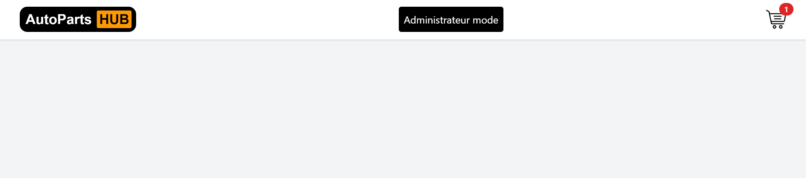
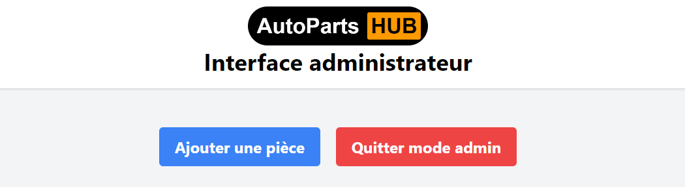
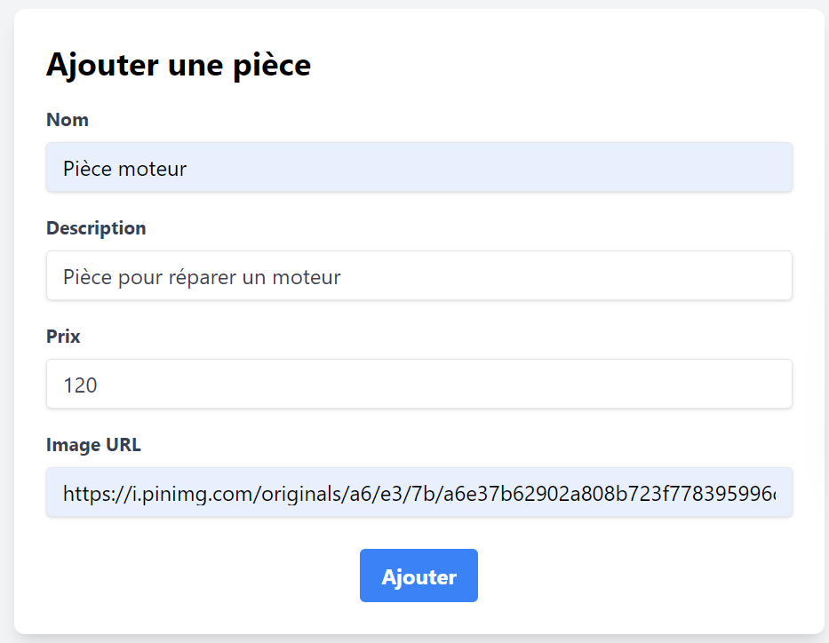
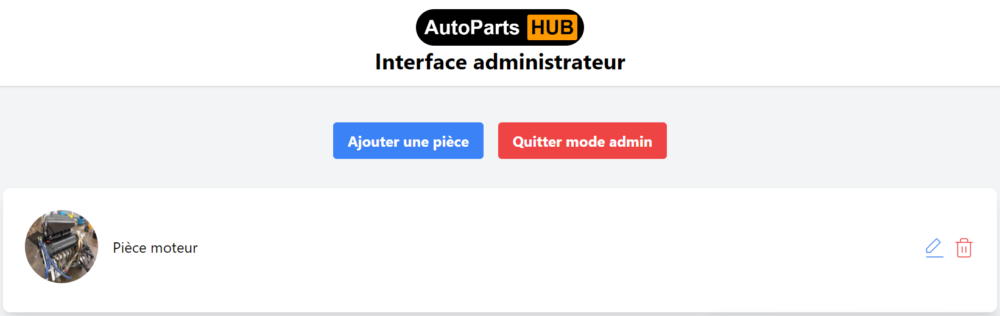
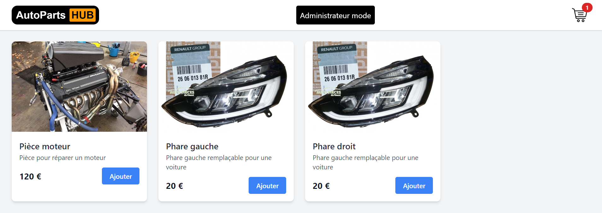
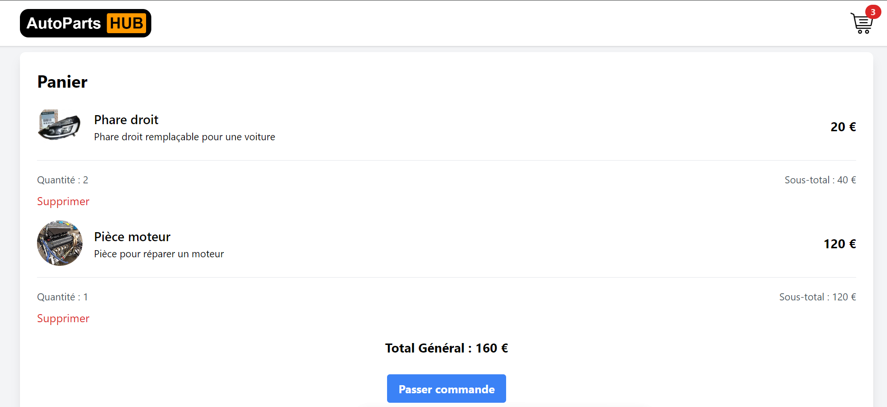

# Démo avec docker-compose

Avant toute chose pour éviter tout problèmes on va nettoyer docker en supprimant tout contenaires , images ,  networks et volumes : 
```bash
# docker system prune -a
```

### Mise en marche

Pour démarrer la démo

Se rendre dans le répertoire `/DEMO`

Construire les conteneurs à partir de docker-compose : 
```bash
autoparts\DEMO\ # docker-compose up
``` 
Les 3 contenaires vont se lancer un à un pour vérifier que ça c'est bien lancer on aller sur l'adresse `localhost:8080` 

### Scénario

#### Aller à l'adresse du [localhost](localhost:8080)

```
http://localhost:8080
```

/!\ Si l'adresse n'amène sur rien , vérifier que les conteneurs (en particulier celui du front est bien lancé) 

On arrive alors sur le page d'accueil vide de tout contenu. On va alors remplir ce site en passant en administrateur.



#### Passer en administrateur

Il existe de façons de passer sur la page admin : 
- Cliquer sur le bouton `Administrateur mode` (Dans une version final il serait non présent)
- Aller à l'adresse [/admin](localhost:8080/admin)

Il aura alors ensuite une fenêtre qui s'ouvre demandant un mot de passe , rentrer `admin`.

On arrive ensuite sur le dashbord.



#### Ajout d'une pièce

En premier lieu on va ajouter une pièce de moteur

- Cliquer sur `Ajouter une pièce`
- Tous les champs sont obligatoire
- Cliquer sur `ajouter`



/!\ Il faudra actualiser la page pour que la pièce s'affiche




On rajoute ensuite d'autre pièces tel que un phare avant gauche et droit , puis on quitte le mode admin




#### Modification d'une pièce

On remarque que la description du phare droit n'est pas la bonne , pour modifier on repart sur le mode admin :

- On trouve la pièce que l'on veut modifier
- On clique sur l'icone du petit crayon
- On modifie la phrase de description
- On appuie sur le bouton `Modifier`

La modification est effectué et dispo sur lapage d'accueil

#### Supprimer une pièce

Le phare gauche est victime de son succès et n'est plus disponible , on doit donc le supprimer :

- Toujours dans le mode admin
- Trouver le phare gauche 
- Appuyer sur la poubelle rouge
- ATTENTION il n'y a pas de retour possible une fois cliquer


## Commander une pièce

- sur la page d'accueil
- choisir les pièces que l'on veut (par exemple 2 phare droit et une pièce moteur)
- aller dans le panier (icone en haut à droite)
- passer commande


